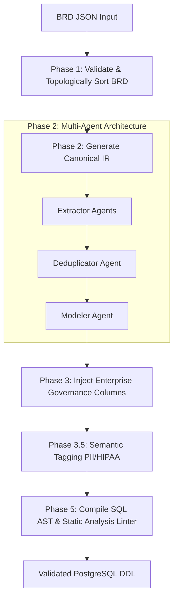
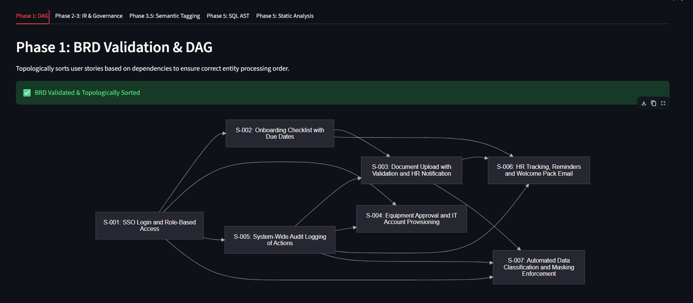
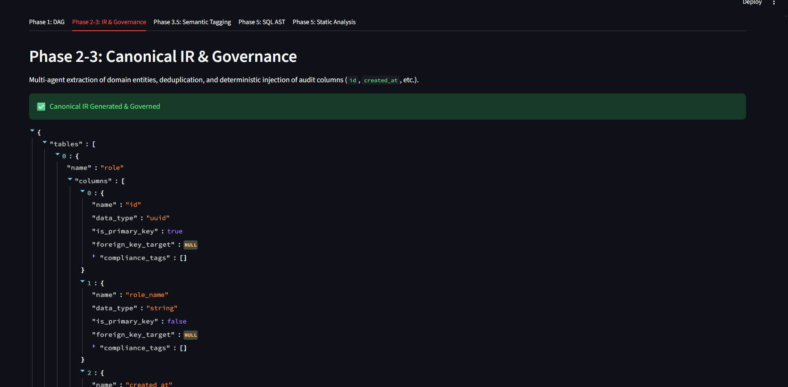
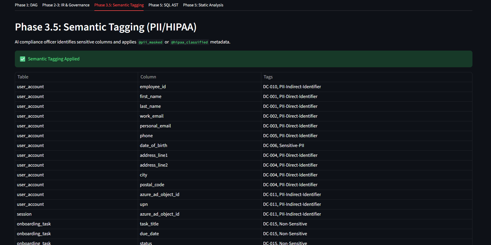
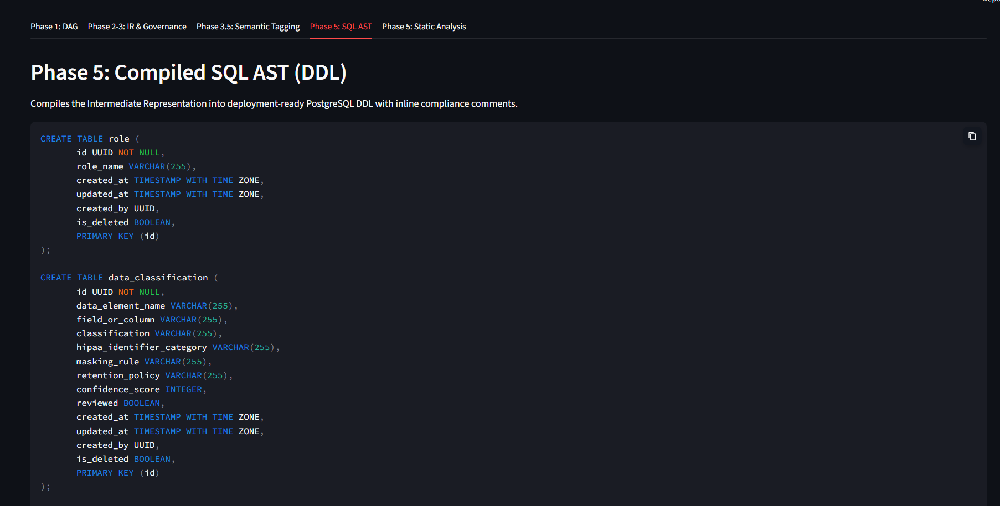
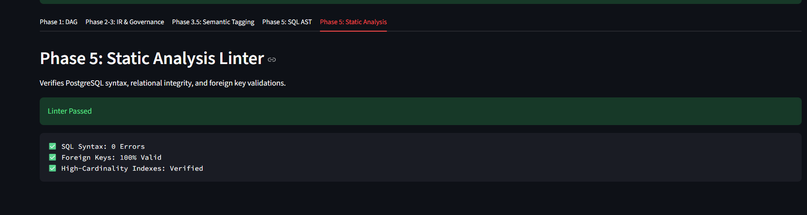

# Enterprise Schema Scaffolder 🚀

An automated pipeline designed to bridge the gap between business requirements and technical database architecture. The Enterprise Schema Scaffolder ingests raw Agile artifacts (Epics and User Stories), uses specialized AI agents to extract data models, enforces non-negotiable enterprise standards deterministically, and outputs a validated, deployment-ready PostgreSQL database schema (DDL).

## Pipeline Flowchart



## Setup & Deployment

1. **Clone the repo and setup the environment**:
   ```bash
   python -m venv venv
   source venv/Scripts/activate # Windows
   pip install -r requirements.txt
   ```
2. **Environment Variables**:
   Create a `.env` file in the root directory and add your Anthropic API Key:
   ```env
   ANTHROPIC_API_KEY=your-api-key-here
   ```
3. **Run Locally**:
   ```bash
   streamlit run app.py
   ```

## Pipeline Phases & Output

### 📥 Phase 1: BRD Validation & DAG
Parses the raw JSON input and orders the user stories based on their dependencies using a directed acyclic graph (DAG) to ensure that foundational entities are processed first.



### 🤖 Phase 2-3: Canonical IR & Governance
Uses an Anthropic-powered Orchestrator-Worker Multi-Agent system to extract domain entities, deduplicate them, and enforce enterprise architectural standards (like UUID primary keys and audit columns).



### 🛡️ Phase 3.5: Semantic Tagging (PII/HIPAA)
An AI-driven compliance officer agent audits the schema for sensitive data and applies security metadata directly to the schema before deployment.



### 💾 Phase 5: Compiled SQL AST (DDL)
Compiles the Intermediate Representation into raw PostgreSQL DDL using SQLAlchemy, and injects compliance tags as inline SQL comments.



### ✅ Phase 5: Static Analysis Linter
Runs strict syntax and integrity checks against the generated output to verify perfect PostgreSQL syntax and validate all Foreign Key targets.


